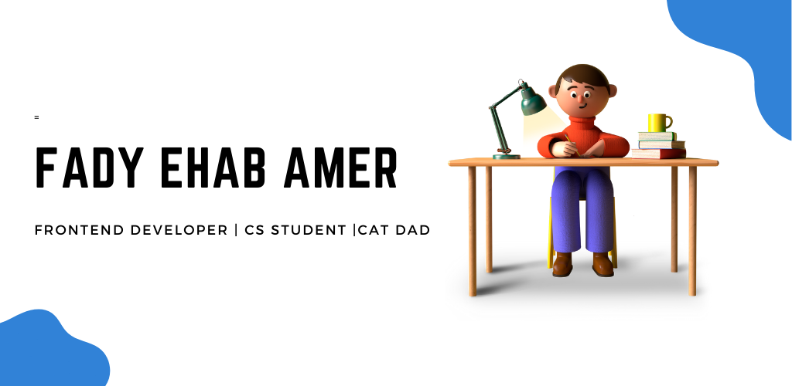

  

<h1 align="center">Hey, I'm Fady Ehab 👋</h1>

  Frontend Developer specializing in Arabic/RTL web experiences · React · Angular · React Native · MENA Market

  
  
  
  
  
  

 

---

### 🧑‍💻 About Me

- 🌍 Frontend developer focused on **Arabic/RTL web experiences** for the **Saudi & MENA market**
- ⚡ I build with **React**, **Angular**, **React Native** — and customize **Salla e-commerce** storefronts
- 🕌 Side project: Building a **Quran PWA** (azkar & dhikr app)
- 🎯 2026 Goals: Ship production-scale apps, deepen Angular expertise, grow in the MENA frontend scene
- 📺 Fun fact 1: YouTuber with **CSS animation & UI tricks** content · 1K+ views
- 🏊 Fun fact 2: Part-time swimming coach

---

### 💻 Tech Stack

**Frontend**

**Backend & Languages**

**Deployment & Tools**

---

### 📊 GitHub Stats

---

### 📺 Latest YouTube Videos

CSS & UI animation tutorials for frontend developers:

- [SVG Text animation 🔅🔆 using CSS3](https://www.youtube.com/watch?v=4nMoIKhY0JM&t=13s)
- [Custom cursor ❌ using pure CSS3](https://www.youtube.com/watch?v=mCyXI00u2f4&t=3s)
- [Hinata card ♾️ using CSS3](https://www.youtube.com/watch?v=KJCMXjVpsG0&t=397s)
- [Firework effects 🎇 using jQuery plugin](https://www.youtube.com/watch?v=cqfYSoXj_UQ)
- [Hover effect 👆 using pure CSS3](https://www.youtube.com/watch?v=S2XvcUWyKWQ&t=18s)
- [Windows 10 Loader 😴 using CSS3 Animation](https://www.youtube.com/watch?v=zmYSQGYb0eM)

---

### 🌎 Problem Solving Progress

| Platform  | Profile | Level / Stars | Solved | Language |
|-----------|---------|---------------|--------|----------|
| Edabit    | [fadyehabamer](https://edabit.com/user/DXa4QWAASdwrmo42q) | Lvl 7 · 1,180 XP | — | JavaScript |
| LeetCode  | [fadyehabamer](https://leetcode.com/fadyehabamer/) | Lvl 1 | 3 problems | JavaScript |
| CoderHub  | [fadyehabamer](https://profile.satr.codes/user/fadyehabamer) | ⭐⭐⭐⭐ | 97 problems | JavaScript |
