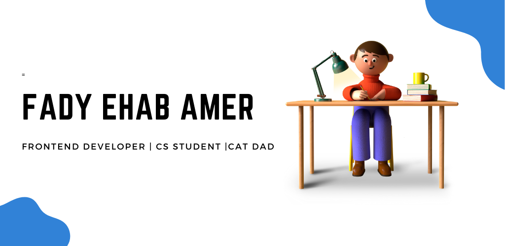

<h1 align="center">Fady Ehab Amer</h1>

  <b>Software engineer · Frontend &amp; full-stack · Egypt · Remote</b>

  
  
  
  

I'm Fady, a software engineer who builds the parts you don't see: zero-dependency frameworks, accessible component libraries, PWAs, and published browser extensions.

I work with React, Angular, TypeScript and .NET for clients across Egypt, Saudi Arabia and the Gulf, and I've shipped 150+ Salla and Zid storefronts. I care about the details most people never notice: real focus states, RTL and Arabic typography, a working reduced-motion path, and small bundles.

مطوّر واجهات أمامية من مصر، أبني مواقع وتطبيقات ويب تدعم اللغة العربية والاتجاه من اليمين إلى اليسار.

- **#1** GitHub contributor in Egypt, 2023
- **35th** in the CSS Battle world ranking
- **2,000+** users across my published Chrome extensions

---

## Get in touch

Available for select freelance work. The best place to start is [fadyehabamer.com](https://www.fadyehabamer.com/), or email me at [fadyamer45@gmail.com](mailto:fadyamer45@gmail.com).
